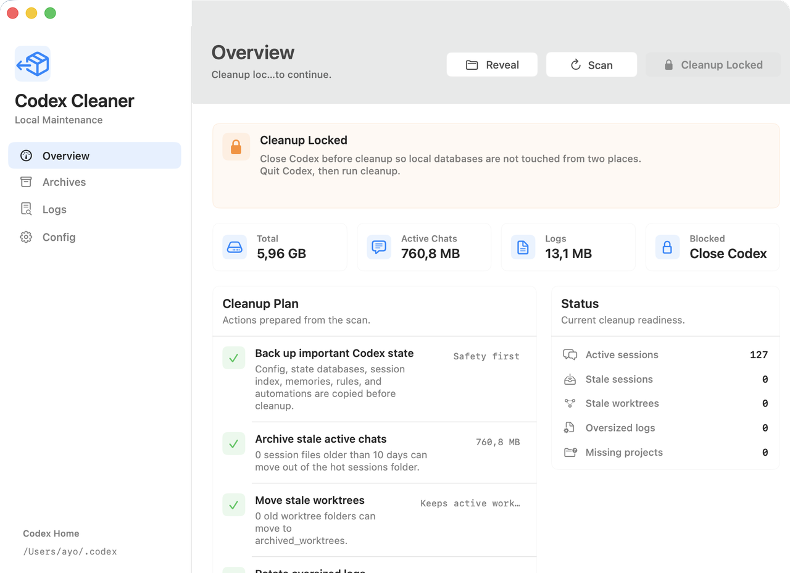
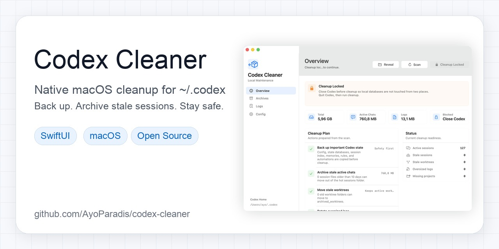

# Codex Cleaner

Codex Cleaner is an open-source native macOS utility for keeping the Codex
desktop app fast by safely maintaining local `~/.codex` state.

Codex Cleaner scans first, backs up important state, then archives stale chats,
worktrees, generated artifacts, shell snapshots, and oversized logs. It stays
safe by default, with a narrow opt-in for deleting generated bloat.



## Social Preview

Use this image when sharing the project or configuring the GitHub repository
social preview:



```txt
docs/social-preview.jpg
```

The image is 1280 x 640 and under 1 MB, matching GitHub's recommended social
preview format.

## Credit

This project was inspired by Meta Alchemist
([@meta_alchemist](https://x.com/meta_alchemist)) and
[their Codex cleanup tweet](https://x.com/meta_alchemist/status/2050270281521045844).
The tweet described a practical 15-point maintenance checklist: inspect first,
back up important state, archive stale chats/worktrees/logs, prune dead config,
verify the result, and make the process boring enough to run regularly.

Codex Cleaner turns that checklist into a one-button native Mac app for
developers using Codex, SwiftUI, and local AI coding workflows.

## What It Does

- Scans `~/.codex` for active sessions, archived sessions, logs, worktrees,
  generated image runs, shell snapshots, and config project entries.
- Backs up important local Codex state before changing anything.
- Archives active session files older than 10 days.
- Moves stale worktrees older than 14 days into `archived_worktrees`.
- Archives stale generated image runs into `archived_generated_images`.
- Archives stale shell snapshot scripts into `archived_shell_snapshots`.
- Offers an explicit opt-in to permanently delete stale generated image runs and
  shell snapshot scripts instead of archiving them.
- Rotates oversized `logs_*` SQLite files, including related `-wal` and `-shm`
  files.
- Prunes trusted project paths from `config.toml` when the folder no longer
  exists.
- Refuses to run cleanup while Codex is open.

## Safety Model

By default, cleanup moves files into archive folders under `~/.codex`; it does
not delete sessions, logs, worktrees, generated image runs, or shell snapshots.
If enabled, the delete option only removes stale generated image runs and shell
snapshot scripts. It does not delete chats, worktrees, logs, databases, config,
backups, or project settings.

Before each cleanup, the app creates a timestamped backup in:

```txt
~/.codex/maintenance_backups
```

Codex Cleaner also blocks mutation while Codex is running so local SQLite files
are not touched from two places at once.

## Install On macOS

Clone the repo, build the app bundle, then copy it into `/Applications`:

```sh
git clone https://github.com/AyoParadis/codex-cleaner.git
cd codex-cleaner
./Scripts/build-app.sh
ditto ".build/app/Codex Cleaner.app" "/Applications/Codex Cleaner.app"
open "/Applications/Codex Cleaner.app"
```

## Run From Source

```sh
./Scripts/build-app.sh
open ".build/app/Codex Cleaner.app"
```

## Verify

```sh
swift test
./Scripts/build-app.sh
```

## Release Notes

### v1.0.10

- Fixed cleanup staying locked after Codex closed when helper processes from
  `Codex.app` were still running.
- Kept the safety check for the real main Codex app process.
- Added regression tests for main app and helper process detection.

### v1.0.9

- Expanded pre-cleanup backups for current Codex installs to include goals and
  memories SQLite files plus their `-wal` and `-shm` files.
- Added regression coverage for the expanded backup set.

### v1.0.8

- Added an explicit opt-in to delete stale generated bloat.
- Limited deletion to generated image runs and shell snapshot scripts.
- Added simple UI copy explaining what will be deleted and what stays safe.

### v1.0.7

- Added current-Codex artifact cleanup for generated images and shell snapshots.
- Added artifact metrics and cleanup result counts.
- Updated the app bundle version to 1.0.7.

### v1.0.0

- Initial native SwiftUI macOS app.
- One-button scan and cleanup flow.
- Safe backup-before-mutation behavior.
- Active chat, worktree, log, and config cleanup.
- SQLite log-family rotation for `logs_*`, `-wal`, and `-shm` files.
- Light-mode native Apple internal-tool design.

## License

MIT
