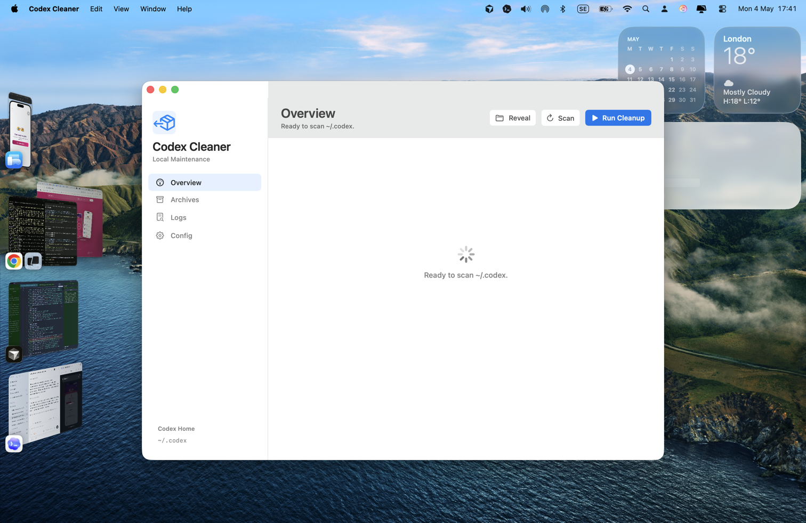

# Codex Cleaner

A small native macOS utility for keeping the Codex desktop app fast by cleaning
up local `~/.codex` state safely.

Codex Cleaner scans first, backs up important state, then archives stale chats,
worktrees, and oversized logs. It does not delete your Codex sessions.



## Credit

This project was inspired by Meta Alchemist
([@meta_alchemist](https://x.com/meta_alchemist)) and
[their Codex cleanup tweet](https://x.com/meta_alchemist/status/2050270281521045844).
The tweet described a practical 15-point maintenance checklist: inspect first,
back up important state, archive stale chats/worktrees/logs, prune dead config,
verify the result, and make the process boring enough to run regularly.

Codex Cleaner turns that checklist into a one-button native Mac app.

## What It Does

- Scans `~/.codex` for active sessions, archived sessions, logs, worktrees, and
  config project entries.
- Backs up important local Codex state before changing anything.
- Archives active session files older than 10 days.
- Moves stale worktrees older than 14 days into `archived_worktrees`.
- Rotates oversized `logs_*` SQLite files, including related `-wal` and `-shm`
  files.
- Prunes trusted project paths from `config.toml` when the folder no longer
  exists.
- Refuses to run cleanup while Codex is open.

## Safety Model

Cleanup moves files into archive folders under `~/.codex`; it does not delete
sessions, logs, or worktrees.

Before each cleanup, the app creates a timestamped backup in:

```txt
~/.codex/maintenance_backups
```

Codex Cleaner also blocks mutation while Codex is running so local SQLite files
are not touched from two places at once.

## Install On macOS

Clone the repo, build the app bundle, then copy it into `/Applications`:

```sh
git clone https://github.com/AyoCodess/codex-cleaner.git
cd codex-cleaner
./Scripts/build-app.sh
ditto ".build/app/Codex Cleaner.app" "/Applications/Codex Cleaner.app"
open "/Applications/Codex Cleaner.app"
```

## Run From Source

```sh
./Scripts/build-app.sh
open ".build/app/Codex Cleaner.app"
```

## Verify

```sh
swift test
./Scripts/build-app.sh
```

## Release Notes

### v1.0.0

- Initial native SwiftUI macOS app.
- One-button scan and cleanup flow.
- Safe backup-before-mutation behavior.
- Active chat, worktree, log, and config cleanup.
- SQLite log-family rotation for `logs_*`, `-wal`, and `-shm` files.
- Light-mode native Apple internal-tool design.

## License

MIT
